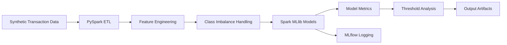
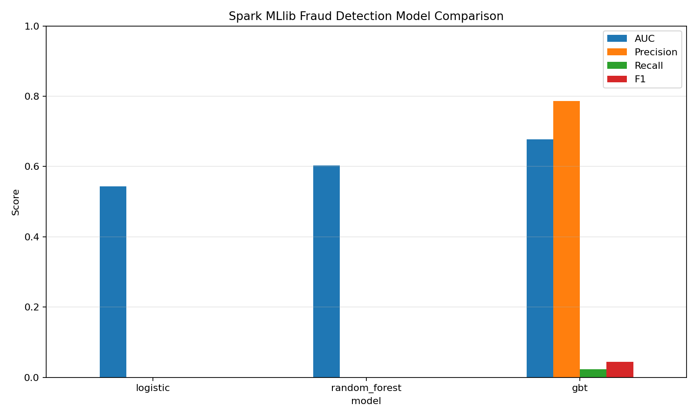
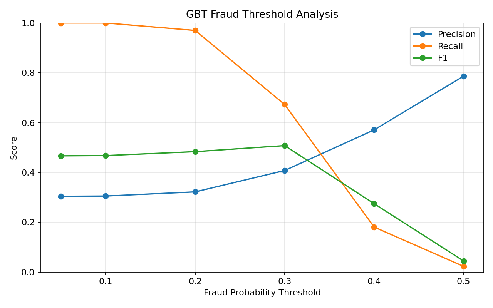
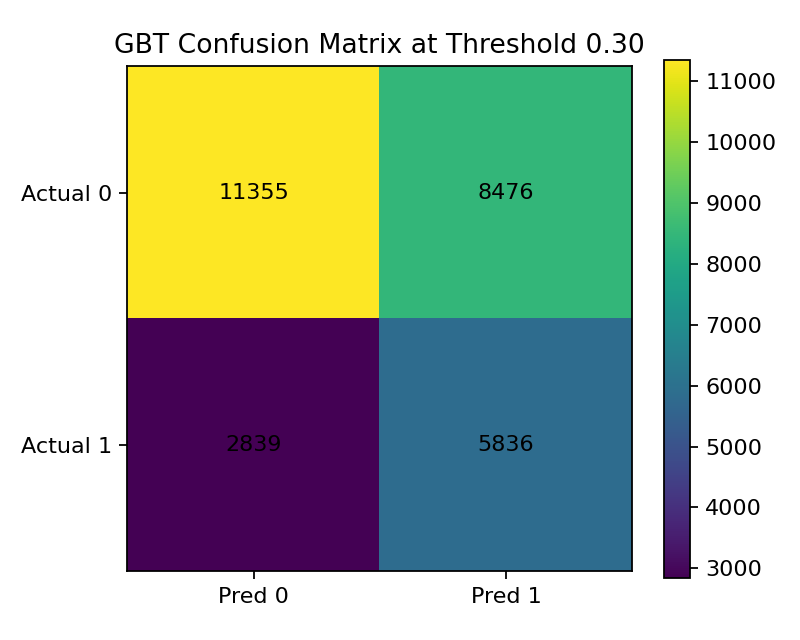

# Spark MLlib Fraud Detection Pipeline

> Runnable Spark-based machine learning pipeline for synthetic financial fraud detection, covering data simulation, PySpark ETL, class imbalance handling, Spark MLlib model training, MLflow logging, cross-validation, and probability-threshold analysis.

[]()
[]()
[]()
[]()
[]()

---

## Overview

This project demonstrates a **runnable end-to-end fraud detection pipeline** using PySpark and Spark MLlib.

The pipeline simulates financial transaction data, applies distributed feature engineering, handles class imbalance using Spark-native oversampling, trains multiple Spark MLlib classifiers, logs metrics with MLflow, and evaluates how probability-threshold tuning affects fraud detection performance.

The key learning from this project is that fraud detection cannot be evaluated using default model predictions alone. In highly imbalanced settings, models may achieve nonzero AUC while still predicting very few or no fraud cases at the default classification threshold. This project therefore includes a dedicated **threshold analysis** step to study the precision-recall tradeoff.

---

## Project Goals

The goal of this project is to build a practical ML engineering workflow for fraud detection:

- generate synthetic transaction data,
- build a PySpark ETL and feature-engineering pipeline,
- train Spark MLlib models,
- handle imbalanced fraud labels,
- compare model performance using AUC, precision, recall, and F1,
- log runs with MLflow,
- tune Random Forest hyperparameters with Spark cross-validation,
- and analyze probability thresholds for better fraud recall.

---

## Pipeline Architecture



---

## Implemented Components

| Component | File | Status |
|---|---|---|
| Synthetic transaction generation | `data_simulation.py` | Implemented |
| PySpark ETL and feature engineering | `etl_pipeline.py` | Implemented |
| Spark-native oversampling | `imbalance_handler.py` | Implemented |
| MLlib model training and evaluation | `model_training.py` | Implemented |
| MLflow metric logging | `mlflow_logging.py` | Implemented |
| Random Forest cross-validation | `rf_hyperparam_tuning.py` | Implemented |
| End-to-end pipeline runner | `run_pipeline.py` | Implemented |
| Output plots and metrics | `outputs/` | Implemented |
| Databricks archive export | `Spark + MLFlow + ETL - Fraud Detection.dbc` | Included |

---

## Dataset

The pipeline generates a synthetic financial transaction dataset with features such as:

| Feature | Description |
|---|---|
| `transaction_id` | Unique transaction identifier |
| `user_id` | Simulated customer ID |
| `timestamp` | Transaction timestamp |
| `amount` | Transaction amount sampled from an exponential distribution |
| `merchant_category` | Merchant type such as grocery, electronics, travel, restaurant |
| `location` | Simulated transaction location |
| `device_type` | Device/channel such as mobile, web, ATM |
| `is_fraud` | Binary fraud label |

The default synthetic generator creates a fraud rate of approximately 1 percent before balancing.

---

## Feature Engineering

The ETL pipeline uses PySpark to transform raw transaction data into model-ready features.

Implemented transformations include:

- timestamp parsing,
- extracting hour of day,
- extracting day of week,
- log-transforming transaction amount,
- indexing categorical features,
- assembling feature vectors for Spark MLlib.

Feature columns include:

```text
hour_of_day
day_of_week
amount_log
merchant_category_index
location_index
device_type_index
```

---

## Models Trained

The pipeline trains and evaluates three Spark MLlib classifiers:

| Model | Purpose |
|---|---|
| Logistic Regression | Linear baseline |
| Random Forest | Tree ensemble baseline |
| Gradient-Boosted Trees | Nonlinear boosted model |

The project also includes Random Forest hyperparameter tuning using Spark MLlib `CrossValidator`.

---

## Results

The latest run produced the following held-out model comparison:

| Model | AUC | TP | TN | FP | FN | Precision | Recall | F1 |
|---|---:|---:|---:|---:|---:|---:|---:|---:|
| Logistic Regression | 0.5436 | 0 | 19831 | 0 | 8675 | 0.0000 | 0.0000 | 0.0000 |
| Random Forest | 0.6032 | 0 | 19831 | 0 | 8675 | 0.0000 | 0.0000 | 0.0000 |
| Gradient-Boosted Trees | 0.6769 | 199 | 19777 | 54 | 8476 | 0.7866 | 0.0229 | 0.0446 |

The Random Forest cross-validation run reported:

```text
Best Random Forest cross-validation AUC: 0.9643
```

This cross-validation AUC is reported separately from the held-out model comparison because it comes from the Spark cross-validation workflow rather than the same default-threshold evaluation table.

---

## Model Comparison



The model comparison shows that Gradient-Boosted Trees had the strongest held-out AUC among the default-threshold models and was the only model that predicted positive fraud cases at the default threshold.

---

## Key Finding: Default Thresholds Are Too Conservative

At the default classification threshold, Logistic Regression and Random Forest predicted no fraud cases, even though their AUC values were nonzero.

This is a common issue in imbalanced fraud detection:

- AUC measures ranking quality across thresholds.
- Precision, recall, and F1 depend on a chosen classification threshold.
- A model can rank risky cases somewhat better than random while still predicting no positives at the default threshold.
- Fraud detection systems often require threshold tuning, cost-sensitive learning, or stronger imbalance handling.

---

## GBT Threshold Analysis

To address the default-threshold limitation, the pipeline evaluates Gradient-Boosted Trees across multiple fraud-probability thresholds.

| Threshold | TP | TN | FP | FN | Precision | Recall | F1 |
|---:|---:|---:|---:|---:|---:|---:|---:|
| 0.05 | 8675 | 1 | 19830 | 0 | 0.3043 | 1.0000 | 0.4666 |
| 0.10 | 8675 | 88 | 19743 | 0 | 0.3053 | 1.0000 | 0.4677 |
| 0.20 | 8415 | 2111 | 17720 | 260 | 0.3220 | 0.9700 | 0.4835 |
| 0.30 | 5836 | 11355 | 8476 | 2839 | 0.4078 | 0.6727 | 0.5078 |
| 0.40 | 1568 | 18653 | 1178 | 7107 | 0.5710 | 0.1807 | 0.2746 |
| 0.50 | 199 | 19777 | 54 | 8476 | 0.7866 | 0.0229 | 0.0446 |



The threshold analysis shows the expected fraud-detection tradeoff:

- Lower thresholds increase recall but produce many false positives.
- Higher thresholds improve precision but miss most fraud cases.
- A threshold around **0.30** provides a better balance in this run, reaching approximately **0.508 F1** and **0.673 recall**.

---

## Confusion Matrix at Selected Threshold

The default threshold of 0.50 was too conservative for fraud recall. The figure below shows the GBT confusion matrix at threshold 0.30.



At this threshold, the model catches substantially more fraud cases than the default threshold, at the cost of more false positives. This is often an acceptable tradeoff in fraud detection workflows where missed fraud can be more expensive than manual review.

---

## Output Artifacts

The pipeline writes metrics and figures to the `outputs/` directory.

| Artifact | Description |
|---|---|
| `outputs/model_comparison.csv` | Held-out model comparison metrics |
| `outputs/results_summary.md` | Markdown summary of latest run |
| `outputs/model_comparison.png` | Model comparison plot |
| `outputs/gbt_threshold_analysis.csv` | Threshold-level precision/recall/F1 table |
| `outputs/gbt_threshold_analysis.png` | Threshold analysis plot |
| `outputs/confusion_matrix_gbt_threshold_30.png` | GBT confusion matrix at threshold 0.30 |

---

## Repository Structure

```text
Spark-MLlib-ETL-Fraud-Detection-pipeline/
├── data_simulation.py
├── etl_pipeline.py
├── imbalance_handler.py
├── model_training.py
├── rf_hyperparam_tuning.py
├── mlflow_logging.py
├── run_pipeline.py
├── requirements.txt
├── data.zip
├── Spark + MLFlow + ETL - Fraud Detection.dbc
├── outputs/
│   ├── model_comparison.csv
│   ├── results_summary.md
│   ├── model_comparison.png
│   ├── gbt_threshold_analysis.csv
│   ├── gbt_threshold_analysis.png
│   └── confusion_matrix_gbt_threshold_30.png
├── LICENSE
└── README.md
```

---

## How to Run

### 1. Clone the repository

```bash
git clone https://github.com/AjaySreekumar47/Spark-MLlib-ETL-Fraud-Detection-pipeline.git
cd Spark-MLlib-ETL-Fraud-Detection-pipeline
```

### 2. Create a virtual environment

```bash
python -m venv .venv
```

Activate it.

On Windows:

```bash
.venv\Scripts\activate
```

On macOS/Linux:

```bash
source .venv/bin/activate
```

### 3. Install dependencies

```bash
pip install -r requirements.txt
```

### 4. Ensure Java is installed

PySpark requires Java. Java 17 is recommended.

Check Java:

```bash
java -version
```

If Java is installed but PySpark cannot find it, set `JAVA_HOME`.

Example on Windows:

```bash
set "JAVA_HOME=C:\Program Files\Eclipse Adoptium\jdk-17.0.x-hotspot"
set "PATH=%JAVA_HOME%\bin;%PATH%"
```

### 5. Run the pipeline

```bash
python run_pipeline.py
```

The script will:

1. generate synthetic data if needed,
2. run PySpark ETL,
3. apply Spark-native oversampling,
4. train Logistic Regression, Random Forest, and GBT models,
5. log metrics to MLflow,
6. run Random Forest cross-validation,
7. evaluate GBT probability thresholds,
8. save result tables and plots to `outputs/`.

---

## MLflow Logging

The pipeline includes local MLflow metric logging through `mlflow_logging.py`.

Each model run logs:

- model type,
- AUC,
- TP,
- TN,
- FP,
- FN,
- precision,
- recall,
- and F1.

The local MLflow file backend may show a deprecation warning in newer MLflow versions. For a production setup, a database-backed tracking URI such as SQLite or a remote MLflow server would be preferred.

---

## Databricks Export

The repository includes a Databricks archive:

```text
Spark + MLFlow + ETL - Fraud Detection.dbc
```

This archive reflects earlier Databricks-oriented experimentation with Spark, MLflow, and ETL workflows.

---

## Notes and Limitations

This project uses synthetic data, so the results should be interpreted as a pipeline demonstration rather than a production fraud model.

Current limitations:

- synthetic labels are simple and do not encode realistic fraud behavior,
- threshold tuning is demonstrated only for GBT,
- class imbalance handling uses oversampling rather than cost-sensitive learning,
- no production deployment layer is included,
- no real financial data is used.

Despite these limitations, the project demonstrates the core ML engineering workflow needed for scalable fraud modeling.

---

## Future Improvements

Potential extensions:

- add more realistic fraud-generation logic,
- include transaction velocity features,
- add user-level historical aggregates,
- implement cost-sensitive evaluation,
- tune thresholds based on expected fraud-review cost,
- add model persistence and batch inference,
- migrate MLflow tracking to SQLite or a remote tracking server,
- add a lightweight Streamlit monitoring dashboard,
- run the pipeline fully on Databricks or another Spark cluster.

---

## Author

Created by **Ajay Sreekumar**.

This project was developed as a domain-focused ML engineering project covering scalable ETL, Spark MLlib modeling, fraud-detection evaluation, and threshold-aware model analysis.

---

## License

This project is licensed under the MIT License. See `LICENSE` for details.
